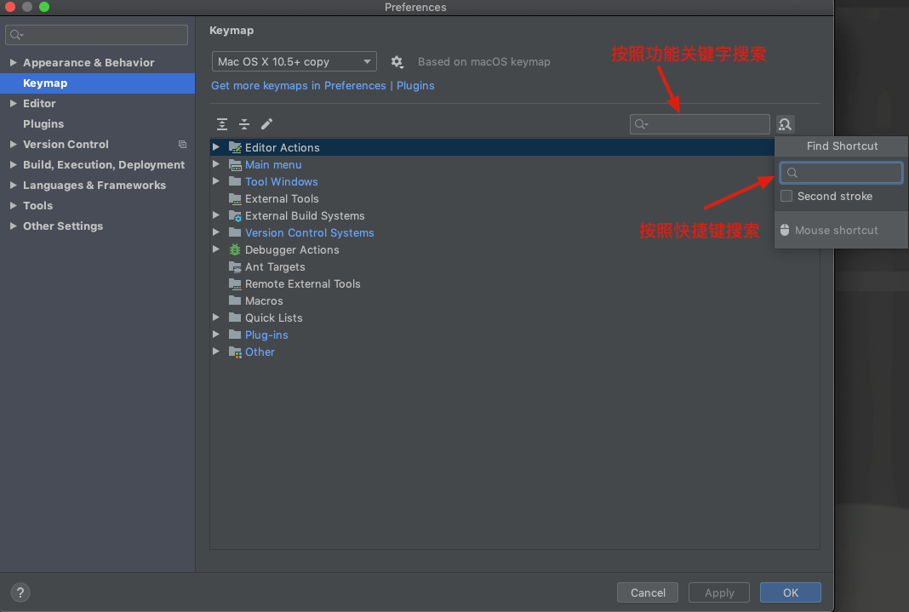
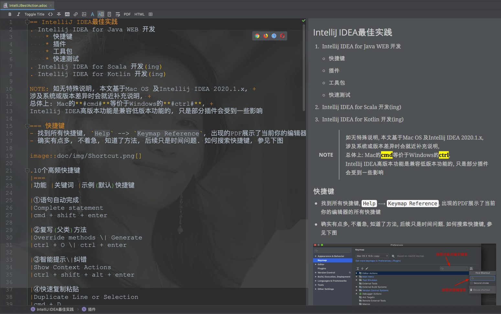
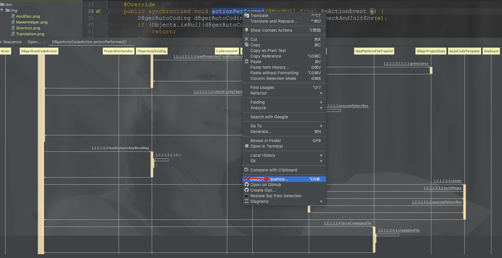
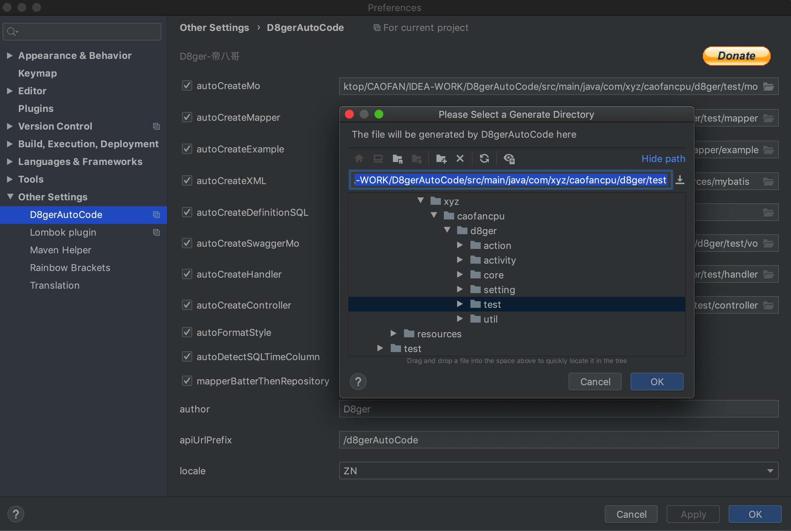
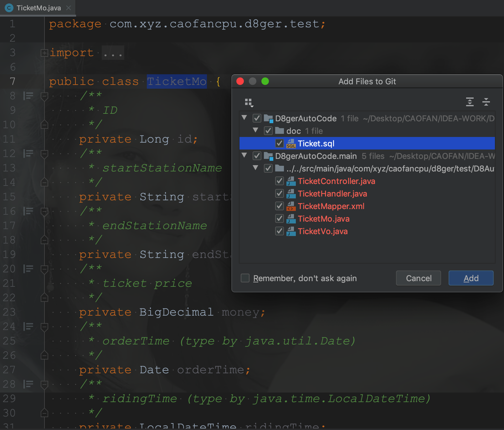
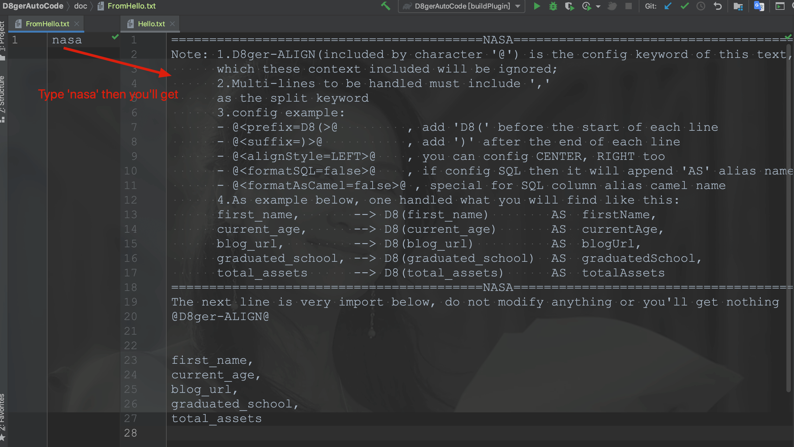
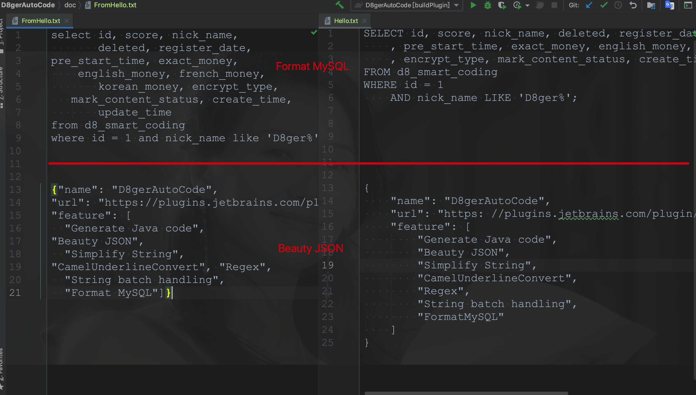
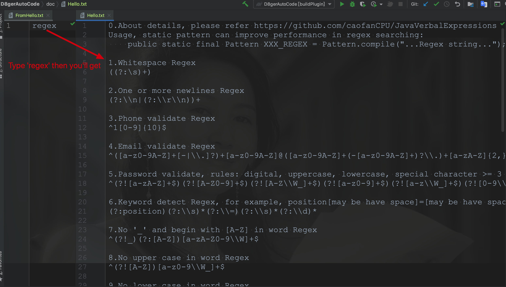

== IntelliJ IDEA最佳实践

. Intellij IDEA for Java WEB 开发
* 快捷键
* 插件
* 快速测试
* 工具包
. Intellij IDEA for Scala 开发(ing)
. Intellij IDEA for Kotlin 开发(ing)

NOTE: 如无特殊说明, 本文基于Mac OS 及Intellij IDEA 2020.1.x, +
涉及系统或版本差异时会就近补充说明, +
总体上: Mac的**#cmd#**等价于Windows的**#ctrl#**, +
Intellij IDEA高版本功能是兼容低版本功能的, 只是部分插件会受到一些影响

=== 快捷键

- 找到所有快捷键, `Help` --> `Keymap Reference`, 出现的PDF展示了当前你的编辑器的所有快捷键
- 确实有点多, 不着急, 知道了方法, 后续只是时间问题.
如何搜索快捷键, 参见下图

.10个高频快捷键
|===
|功能 |关键词 |示例(默认)快捷键

|①语句自动完成
|Complete statement
|cmd + shift + enter

|②复写(父类)方法
|Override methods \| Generate
|ctrl + O \| ctrl + enter

|③智能提示\|纠错
|Show Context Actions
|ctrl + shift + alt + enter

|④快速复制粘贴
|Duplicate Line or Selection
|cmd + D

|⑤查看方法调用
|Call Hierarchy
|ctrl + alt + H

|⑥跳转到父类申明
|Go to Super Method
|cmd + U

|⑦跳转到子类实现
|Go to Declaration or Usages
|cmd + B

|⑧拼接下一行
|Join Lines
|ctrl + shift + J

|⑨优化导包
|Optimize Imports
|ctrl + alt + O

|⑩格式化代码
|Reformat Code
|cmd + alt + L

|更多彩蛋
|安装插件 Key Promoter X
|对于有快捷键的按钮, 当你点击时提示告诉你快捷键
|===

=== 插件

- https://plugins.jetbrains.com/plugin/9792-key-promoter-x/[Key Promoter X]
* 快捷键提示, 新手必备, 而老手也可以通过它得知新版IDEA的一些特性信息
- https://plugins.jetbrains.com/plugin/10080-rainbow-brackets/[Rainbow Brackets]
* 代码括号自动匹配, 彩板护眼
- https://plugins.jetbrains.com/plugin/6317-lombok/[Lombok]
* 这位都听说过吧, 没听过的要么是大佬要么改行吧
* 采坑经验, 使用Lombok时, 尽量避免对象间继承, 如果非要继承, 应考虑@EqualsAndHashCode(callSuper = true : false)
* 示例:

[source,jave]
----
/**
 * balabala
 *
 * @author Mr.X
 */
@Data
@NoArgsConstructor
@AllArgsConstructor
@Accessors(chain = true)
@EqualsAndHashCode(callSuper = true)
public class PormHub extends GitHub{
    private Boolean well = Boolean.FALSE;
}
----

- https://plugins.jetbrains.com/plugin/7391-asciidoc/[AsciiDoc]
* 文档编辑神器, AsciiDoc本身目标是制作大型电子书, 超越MarkDown, 本文就是用AsciiDoc书写完成的
* **Spring**官方、**Spring-Alibaba**官方都采用AsciiDoc撰写文档, **GitHub**也支持AsciiDoc, AsciiDoc是未来的主流, MarkDown貌似要成替补了
* 个人使用体验, 对于写技术文档, 上手快, 简洁, 本文的一个小目标就是为新手提供常用的模块, 支持ctrl + c | v

- https://plugins.jetbrains.com/plugin/8579-translation/[Translation]
* 作为中国程序员, 英语不会咋办?
* 安装该插件, 选中任意文本, *ctrl + alt + T* 一键翻译

- https://plugins.jetbrains.com/plugin/6725-ibatis-mybatis-mini-plugin/[iBATIS/MyBatis mini-plugin]
* 对于采用Mybatis且保留SQL的方式, 从Mapper接口跳转到对应SQL处, 可以借助该插件完成
* 当然现在有很多采用无SQL的方式, 参见 https://github.com/baomidou/mybatis-plus[苞米豆]
- https://plugins.jetbrains.com/plugin/7179-maven-helper/[MavenHelper]
* 国内Java工程多采用Maven来管理依赖, 对于一些不讲究的老项目, 依赖纠缠不清, 这个时候咋办?
* 就这样, 凉拌吧!
* 又或者, MavenHelper带你浴火重生, 请看下图

- https://plugins.jetbrains.com/plugin/8286-sequencediagram/[SequenceDiagram]
* 当我们跳槽后接坑时, 代码的链路是怎样的, 怎么没完没了呢?
* 这个时候, SequenceDiagram带你一览全貌
* 方法调用时序图出来了, 慢慢瞅吧!

- https://plugins.jetbrains.com/plugin/13576-d8gerautocode/[D8gerAutoCode]
* 作为Web开发, 当业务理解清楚后, 开发过程就可以量化如下:
. 表设计
. SQL -> Mapper -> Mo -> -> handler -> *Service* -> Controller
. 自测
. 联调
. PM加需求, 再改一波...

* 在上诉步骤中, 我认为1、2、3步是自己可以控制的, 且步骤2中除了**Service**层代码由业务决定外, 其他基本代码基本如出一辙
* 这意味着什么?
* 据我的观察, 1-3年的大部分程序员就在写这些重复代码, 有时写错或者抄错了, 到调试时定位到问题, 真的浪费不少时间...
* 好在不少前辈通过创建工具, 以逆向工程方式生成``**生产环境可用的**``基础代码, 操作嘛也比较简单, 定义好SQL, 编写配置文件然后运行main方法生成
* 我的编码生涯里也有不少这样的回忆, 只是里面仍旧有不少重复操作, 甚至多人操作时会产生冲突
* 于是, 我从Mo出发, 写了D8gerAutoCode这个插件, 一切以表设计为核心, 你专注设计好Mo就可以, 其他基本代码使用快捷键一键搞定
* 如果D8gerAutoCode只有这个功能, 那其实和其他大佬插件相比没有啥可比性, 大家都用习惯了, 为何要使用新的呢?
* 重点来了: D8gerAutoCode插件专注**`解决重复`**, 在平常工作中的重复工作应该被简化, 在我开来, 程序的初衷不就是如此吗?
* 所以, D8gerAutoCode插件还带有字符串批处理, JSON处理, MySQL处理, 字段命名处理, 针对SwaggerAPI文档的处理, 这些功能是项目开发中都会用到的, 本着一键搞定原则而开发, 欲知详情参见后文

=== 快速测试

