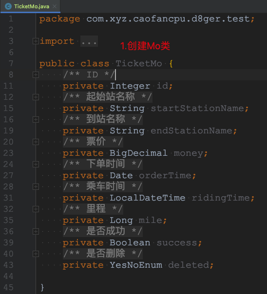
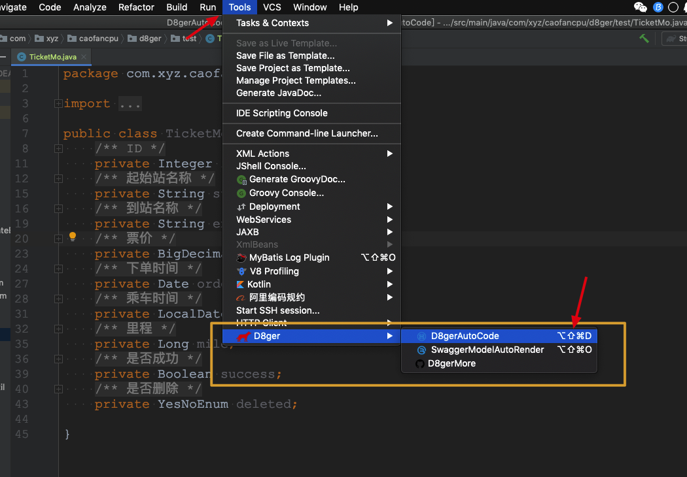
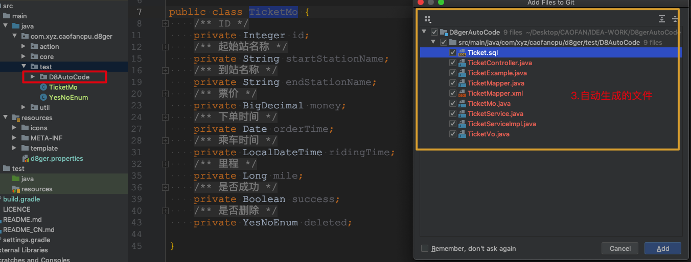
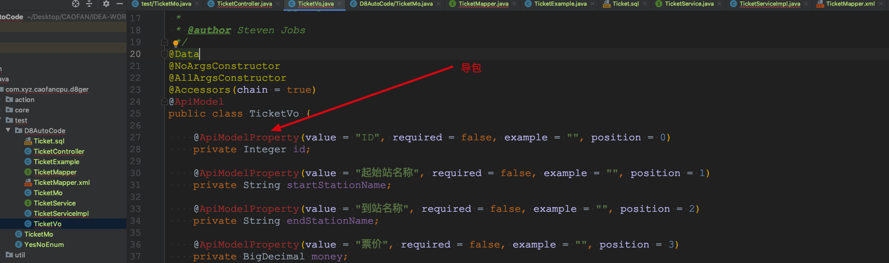
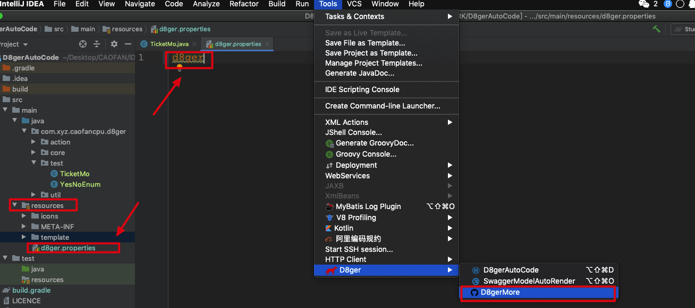
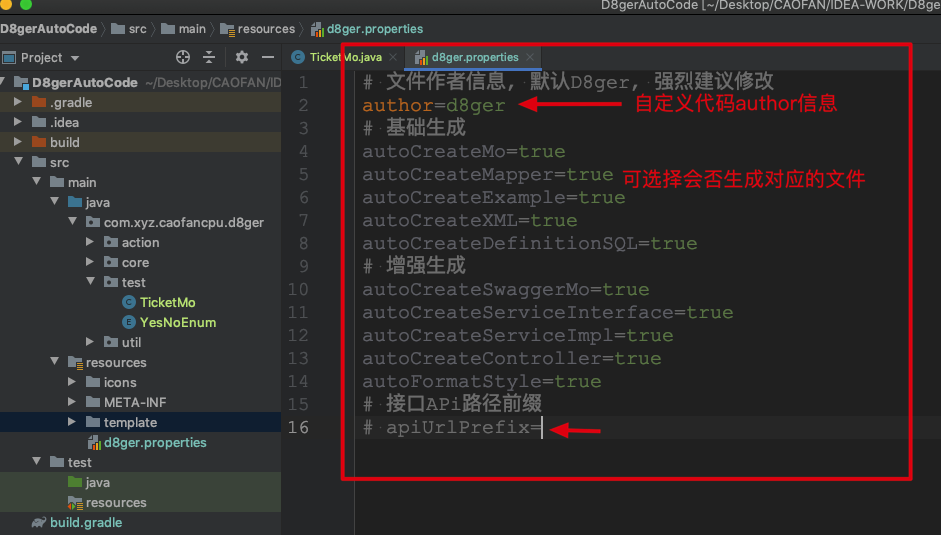
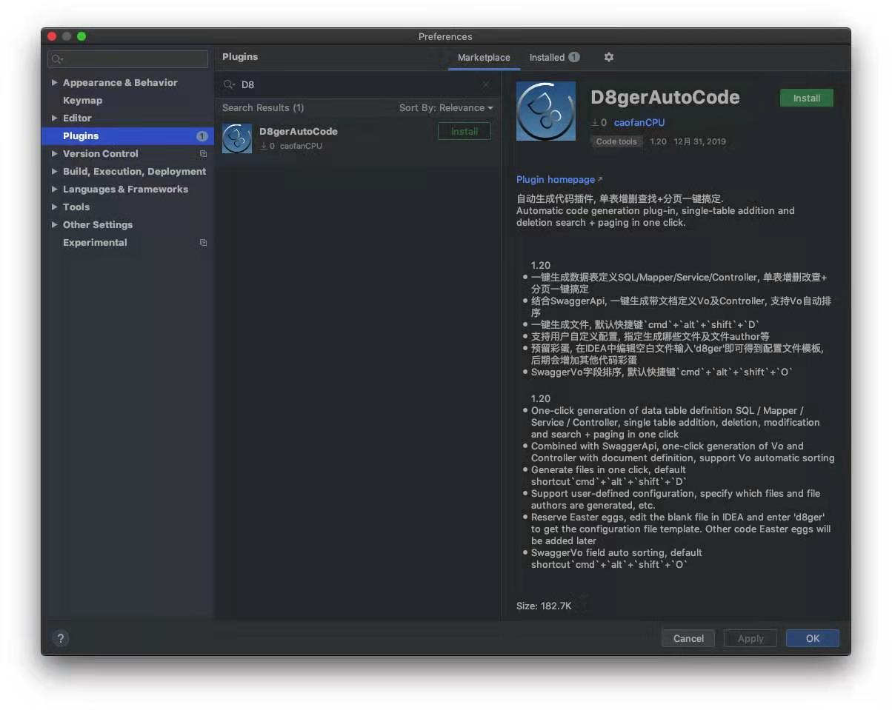

# D8gerAutoCode
##### IDEA Code Automatically Generate Plug-ins • ** `For Java Web Developer` ** Version

##### Convention
- General problem plugin provides standard solutions, personalized problem plugin only provides example solutions

##### Design original intention
- Remove the fixed duplication coding process in development, improve development efficiency  
- Provide available code templates, code that can be used without modification  
- After the code is automatically generated, users need to `ctrl` +` C` / `V` to the project related directory by themselves, and guide the package by themselves  
- Support user-defined configuration, can specify the file to be generated

##### Features
- One-click data table definition SQL / Mapper / Service / Controller, single table addition, deletion, modification and search + paging in one click  
- Combined with SwaggerApi, one-click generation of Vo and Controller with document definition, support Vo field automatic sorting  
- Generate files with one click, the default shortcut is `cmd` +` alt` + `shift` +` D`  
- Support user-defined configuration, specify which files and file authors are generated, etc.  
- Reserve eggs, edit the blank file in IDEA and enter 'd8ger' to get the configuration file template, other code eggs will be added later  
- SwaggerVo field sorting, default shortcut key `cmd` +` alt` + `shift` +` O`  

##### Using screenshots
1. Create Model Class

2. Select the class name and press the (default) shortcut key `cmd` +` alt` + `shift` +` D`
 

3. Under the default configuration, the `D8gerAutoCode` directory and data table SQL definitions and Web codes will be generated, a total of 10

4. What you need to do:
- Move the file to the directory corresponding to the project, for example ** xxMo.java ** into the `model` directory  
- Add non-null constraints to ** xx.sql ** as required  
- If you generated the ** xxController.java ** file, please note that the interface returns the object type, it should be modified to the project's uniform return type  
- In the above steps, the code file will report a red error, which requires you to guide the package to solve  
 

5.Default configuration file template, code color:
    - In the *** resource *** root directory of the module where the `Model class` is located, create the` d8ger.properties` property configuration file
    - Enter `d8ger`, click on` Tools`-> `D8ger`->` D8gerMore`

6. You will get the following default configuration information
    - It is recommended that you change the configuration items  
        - `author` (you can't sign my name in the pit you dug!)  
        - `apiUrlPrefix` (the interface url prefix should be configured as the project interface unified URL prefix)  
    - Other `boolean` configuration items let you choose which files need to be generated

##### how to install
- IDEA official plugin library installation  

- [Download plugin package](http://file.debuggerpowerzcy.top/power/D8gerAutoCode-1.22.zip)  
- Source installation, this requires you to be familiar with Gradle, I will add in detail how to use Gradle to develop a plugin later

##### Bug & Question
-Known issues
> Modify the `d8ger.properties` file before generating code, the configuration file does not take effect
`` `text
Solution
1. Because the IDEA file uses the VFS mechanism, as a plug-in to use the monitoring file I think it is not cost-effective  
2. In addition, the `D8gerAutoCode` directory is an auxiliary. When we generate and modify the code, this directory should come and go.  
3. So, delete the `D8gerAutoCode` directory and you can solve it.
`` `

[Other issues, please come to join room](https://github.com/caofanCPU/D8gerAutoCode/issues)
